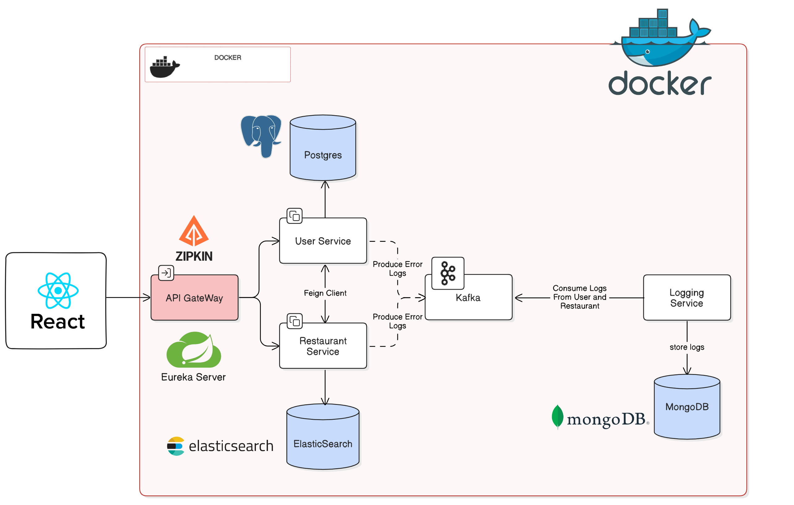

# Restaurant Application

[Go to Turkish README](README_TR.md)

## Project Architecture and System Design

Restaurant App is a comprehensive project that I developed on my own. This application is built using a microservices architecture and consists of five main modules: Eureka-server, api-gateway, user-service, restaurant-service, and logging-service. The Discovery Server serves as a service registry that enables effective communication between microservices. The API Gateway serves as the single entry point for all client requests and forwards them to the appropriate service. The User Service manages users and their reviews for restaurants, providing functions such as user registration, posting reviews, and personalized restaurant recommendations based on user location and restaurant ratings. The Restaurant Service manages all operations related to restaurants, including restaurant registration and listing, and stores all restaurant data in Elastic Search. The Logging Service is a logging service for a Spring Boot application. It uses Apache Kafka for message consumption and MongoDB for data storage. The service is designed to consume error logs from Kafka, store them in MongoDB, and provide an API for retrieving the logs. Each service in this repository has its own README.md file, providing detailed information about the project.