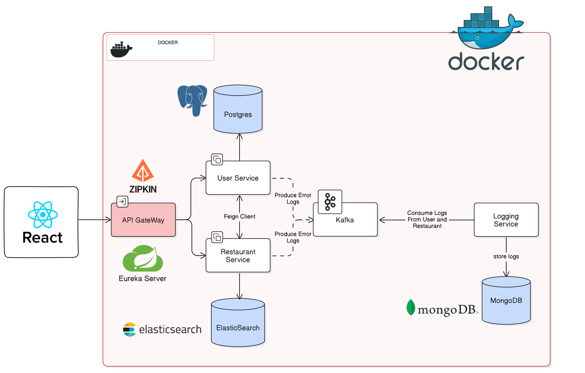

# Dine Experience Uygulaması

[İngilizce README'ye git](README.md)

## Proje Mimarisi ve Sistem Tasarımı

[](./img/project-design.png)

Restaurant Application, Kendim geliştirdiğim kapsamlı bir projedir. Bu uygulama, mikroservisler mimarisi kullanılarak oluşturulmuştur ve beş ana modülden oluşur: eureka-service, api-gateway, user-service, restaurant-service ve logging-service. Eureka-server, mikroservisler arasında etkin iletişimi sağlayan bir servis kaydı görevi görür. Api-gateway, tüm istemci isteklerinin tek giriş noktası olarak hizmet verir ve bunları uygun servise yönlendirir. User-service, kullanıcıları ve restoranlar için yorumlarını yönetir, kullanıcı kaydı, yorum gönderme ve kullanıcı konumu ve restoran derecelendirmelerine dayalı kişiselleştirilmiş restoran önerileri gibi işlevler sunar. Restaurant-service, restoran kaydı ve listeleme dahil olmak üzere restoranlarla ilgili tüm işlemleri yönetir, tüm restoran verileri ElasticSearch'da saklanır ve sorgulanır. Logging-service Bu, bir Spring Boot uygulaması için bir loglama servisidir. Mesaj tüketimi için Apache Kafka'yı ve veri depolama için MongoDB'yi kullanır. Servis, Kafka'dan hata loglarını tüketmek, bunları MongoDB'de saklamak ve logları almak için tasarlanmıştır. Bu depoda bulunan her servis kendi README.md dosyasına sahiptir ve proje hakkında ayrıntılı bilgi sağlar.

### Teknolojiler

---
- Java 17
- Spring Boot
- Spring Data JPA
- OpenAPI documentation
- Docker
- Docker compose
- React for frontend

## Servisler

- [Eureka Server](./eureka-service/README.md): Servis keşfi ve kaydı sağlayan bir Spring Boot uygulamasıdır. Netflix Eureka'yı servisleri kaydetmek ve keşfetmek için kullanır. Discovery Servisi, tüm istemciler için tek giriş noktasıdır. İstekleri uygun servise yönlendirir.

- [API Gateway](./api-gateway/README.md): Kullanıcıları ve restoranları yönetmek için bir RESTful API sağlayan bir Spring Boot uygulamasıdır. Kullanıcıları ve restoranları oluşturma, alama, güncelleme ve silme işlemlerini içerir. API Gateway, tüm istemciler için tek giriş noktasıdır. İstekleri uygun servise yönlendirir. Ayrıca kullanıcıları doğrulama ve yetkilendirme yolu da sağlar.

- [User Service](./user-service/README.md): Kullanıcıları ve kullanıcı yorumlarını yönetmek için bir RESTful API sağlayan bir Spring Boot uygulamasıdır. Kullanıcıları ve kullanıcı yorumlarını oluşturma, alama, güncelleme ve silme işlemlerini içerir. Her kullanıcının ilişkilendirilmiş enlem ve boylam değerleri vardır. Kullanıcı yorumlarının 1 ile 5 arasında bir puanı vardır.

- [Restaurant Service](./restaurant-service/README.md): Restoranları yönetmek için bir RESTful API sağlayan bir Spring Boot uygulamasıdır. Restoranları oluşturma, alama, güncelleme ve silme işlemlerini içerir. Her restoranın ilişkilendirilmiş enlem ve boylam değerleri vardır. Restoran verileri ElasticSearch'de saklanır ve sorgular da ElasticSearch'e yapılır. Servis ayrıca, kullanıcının konumuna ve restoranın puanına dayalı restoran önerileri sağlayan bir API de sunar.

- [Logging Service](./logging-service/README.md): Bu, Spring Boot uygulaması için bir loglama servisidir. Mesaj tüketimi için Apache Kafka'yı ve veri depolama için MongoDB'yi kullanır. Servis, Kafka'dan hata loglarını tüketmek, bunları MongoDB'de saklamak ve logları almak için tasarlanmıştır.

## Docker Deployment

Bu projede, her bir mikroservis ve kullanılan veritabanları Docker konteynerleri olarak çalıştırılmaktadır. Bu, projenin herhangi bir platformda kolayca çalıştırılabilmesini sağlar. Aşağıda, projenin Dockerize edilmiş versiyonunu çalıştırma adımlarını bulabilirsiniz.

### Ön Koşullar

- Docker ve Docker Compose'un yüklü olduğundan emin olun. Docker ve Docker Compose'un nasıl kurulacağına dair talimatlar için [Docker'in resmi belgelerine](https://docs.docker.com/get-docker/) bakabilirsiniz.

### Çalıştırma Adımları

1. Projeyi yerel makinenize klonlayın veya indirin.

2. Terminali açın ve projenin ana dizinine gidin.

3. Aşağıdaki komutu çalıştırın:

    ```bash
    docker-compose up -d
    ```

   Bu komut, Docker Compose dosyasında tanımlanan tüm servisleri ve veritabanlarını başlatır.

4. Tüm konteynerlerin düzgün bir şekilde çalıştığını kontrol etmek için aşağıdaki komutu çalıştırın:

    ```bash
    docker ps
    ```

   Bu komut, çalışan tüm Docker konteynerlerinin bir listesini verir. Her bir mikroservis ve veritabanı için bir konteynerin çalıştığını görmelisiniz.

### Konteynerlerin Durumunu Kontrol Etme

Her bir konteynerin durumunu kontrol etmek için `docker ps` komutunu kullanabilirsiniz. Bu komut, çalışan tüm Docker konteynerlerinin bir listesini verir. Her bir mikroservis ve veritabanı için bir konteynerin çalıştığını görmelisiniz.

### Hizmetlere Erişim

Her bir mikroservis, belirli bir port üzerinden erişilebilir hale getirilmiştir. Aşağıda, her bir mikroservisin hangi portta çalıştığına dair bir liste bulunmaktadır:

- `eureka-service`: 8761
- `api-gateway`: 8080
- `restaurant-service`: 8081
- `user-service`: 8082
- `logging-service`: 8083

Ayrıca, veritabanlarına ve diğer hizmetlere aşağıdaki portlar üzerinden erişilebilir:

- `postgres_db`: 5432
- `mongo_db`: 27017
- `elasticsearch`: 8983
- `zipkin`: 9411
- `kafka`: 9092
- `zookeeper`: 2181

### Konteynerleri Durdurma

Tüm konteynerleri durdurmak için aşağıdaki komutu kullanabilirsiniz:

```bash
docker-compose down
```
## İletişim

### Seyid Ahmet ARVAS

<a href="https://github.com/ahmetarvastr" target="_blank">

</a>
<a href = "mailto:example@gmail.com?subject = Feedback&body = Message">

</a>
<a href="https://linkedin.com/in/seyidahmetarvas" target="_blank">

</a>  

## Seyid Ahmet ARVAS - Restaurant Project

<div align="center">
  
<h3 align="center">Java</h3>
</div>

<div align="center">
  
<h3 align="center">SpringBoot</h3>   
</div>