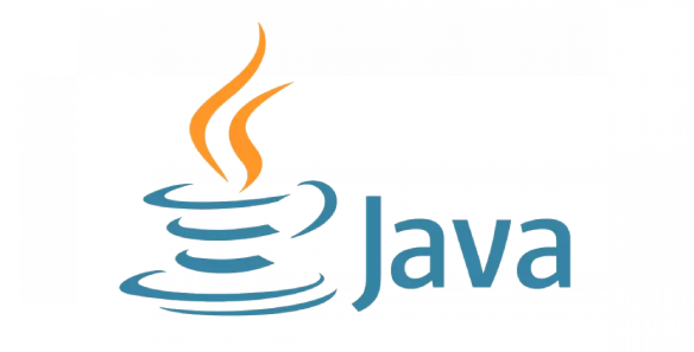

# Hata Kayıt Servisi

[İngilizce README'ye git](README.md)

Bu, Spring Boot uygulaması için bir hata kayıt servisidir. Mesaj tüketimi için Apache Kafka ve veri depolama için MongoDB kullanır. Servis, Kafka'dan hata günlüklerini tüketmek, bunları MongoDB'de saklamak ve günlükleri almak için bir API sağlamak üzere tasarlanmıştır.

## Proje Yapısı

Proje, dört ana pakete ayrılmıştır:

1. `com.seyidahmetarvas.loggingservice.controller`: Bu paket, hata günlüklerini almak için bir REST API sunan `ErrorLogController` sınıfını içerir.

2. `com.seyidahmetarvas.loggingservice.repository`: Bu paket, `MongoRepository`'yi genişleten `LogNotificationRepository` arayüzünü içerir. Bu arayüz, MongoDB'deki `ErrorLog` belgeleri üzerinde CRUD işlemleri için kullanılır.

3. `com.seyidahmetarvas.loggingservice.service`: Bu paket, Kafka konusundan mesajları tüketen ve bunları MongoDB'de `ErrorLog` belgeleri olarak kaydeden `KafkaConsumerService` sınıfını içerir.

4. `com.seyidahmetarvas.loggingservice.entity`: Bu paket, MongoDB'deki hata günlüğü belgelerini temsil eden `LogNotification` sınıfını içerir.

## Kullanım

### Kafka Tüketicisi

`KafkaConsumerService` sınıfı `@Service` (loglama için) ile etiketlenmiştir. Kafka konusu "errorLog"dan mesajları tüketen `consume` adında `@KafkaListener` ile etiketlenmiş bir metodu vardır. Tüketilen mesaj, MongoDB'de bir `LogNotification` belgesi olarak kaydedilir.

### Hata Günlüğü Deposu

`LogNotificationRepository` arayüzü, `MongoRepository<LogNotification, String>`'i genişletir, bu da MongoDB'deki `LogNotification` belgeleri üzerinde CRUD işlemleri için metotlar sağlar.

### Hata Günlüğü Kontrolörü

`ErrorLogController` sınıfı `@RestController` ve `@RequestMapping("/api/v1/error-logs")` ile etiketlenmiştir. MongoDB'den tüm `LogNotification` belgelerini alıp bir liste olarak döndüren `findAll` adında `@GetMapping` ile etiketlenmiş bir metodu vardır.

### Hata Günlüğü Varlık

`LogNotification` sınıfı `@Document(collection = "errorlogdoc")'. MongoDB'deki hata günlüğü belgelerini temsil eder.

## Kurulum

Bu servisi kullanmak için, çalışan bir Apache Kafka ve MongoDB örneğine ihtiyacınız vardır. Ayrıca, uygulamanın özellikler dosyasında Kafka konusu ve MongoDB bağlantı detaylarını yapılandırmanız gerekmektedir.

## Uygulamanın Çalıştırılması

Uygulamayı aşağıdaki komutla çalıştırabilirsiniz:

```bash
mvn spring-boot:run
```

Uygulama çalıştığında, API'ye `http://localhost:8080/api/v1/error-logs` adresinden erişebilirsiniz.


## İletişim

### Seyid Ahmet ARVAS

<a href="https://github.com/ahmetarvastr" target="_blank">

</a>
<a href = "mailto:example@gmail.com?subject = Geri Bildirim&body = Mesaj">

</a>
<a href="https://linkedin.com/in/seyidahmetarvas" target="_blank">

</a>  

## Seyid Ahmet ARVAS - Restaurant Project

<div align="center">

<h3 align="center">Java</h3>
</div>

<div align="center">

<h3 align="center">SpringBoot</h3>   
</div>
