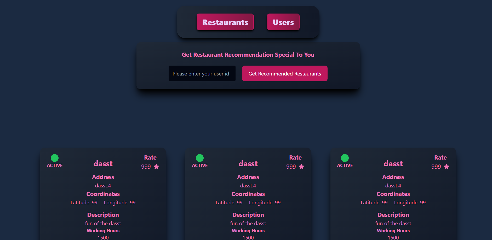

# Restaurant Project Frontend

 [Türkçe](README_TR.md)

Restaurant App is a comprehensive project that I developed on my own. This frontend is designed to interact with the backend services of the application, providing a user-friendly interface for users to register, submit reviews, and receive personalized restaurant recommendations based on their location and restaurant ratings.

## Getting Started

These instructions will get you a copy of the project up and running on your local machine for development and testing purposes.

### Prerequisites

You need to have Node.js and npm installed on your machine. If you don't have these installed, you can download them from [here](https://nodejs.org/en/download/).

### Installing

1. Clone the repository
```bash
git clone https://github.com/ahmetarvastr/restaurant-project
```

2. Navigate into the directory
```bash
cd restaurant-ui
cd restaurant_app
```

3. Install the dependencies
```bash
npm install
```

4. Start the development server
```bash
npm run dev
```

Now, the frontend should be running on [http://localhost:5173](http://localhost:5173).

## Built With

* [React](https://reactjs.org/) - The web framework used
* [npm](https://www.npmjs.com/) - Dependency Management

## Screenshots



## License

Distributed under the MIT License. See [`LICENSE`](LICENSE) for more details.

<!-- CONTACT -->

## Contact

### Seyid Ahmet ARVAS

<a href="https://github.com/ahmetarvastr" target="_blank">

</a>
<a href = "mailto:example@gmail.com?subject = Feedback&body = Message">

</a>
<a href="https://linkedin.com/in/seyidahmetarvas" target="_blank">

</a>  

## Seyid Ahmet ARVAS - Restaurant Project

<div align="center">
  
<h3 align="center">Java</h3>
</div>

<div align="center">
  
<h3 align="center">SpringBoot</h3>   
</div>